# Submitting Deliverables

We will have you follow these steps when copying down the deliverable assignments and then submitting them.

## Pulling Down the Assignment 

<br/>

1. From the class schedule at https://github.com/SEIR59/seir-schedule/, click on the link for the deliverable assignment you want to start working on.

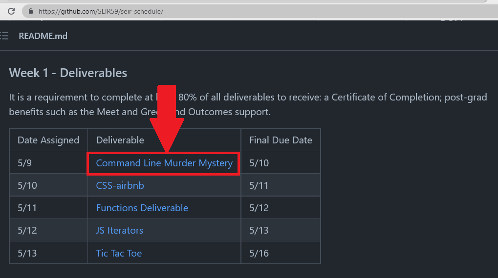

<br/>

-----------------------------------------

This will take you to the repo for that assignment. _Notice the top right corner indicates that the repo is on the class account and not your own account._

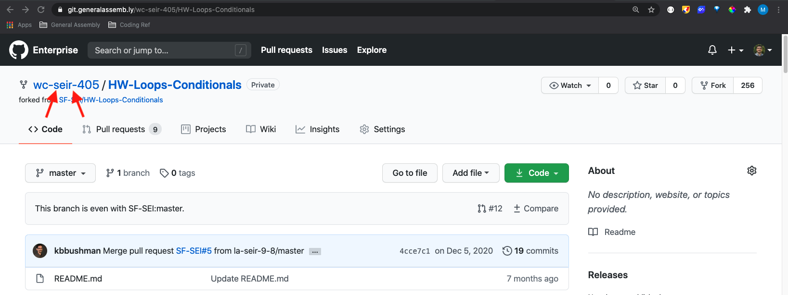

<br/>

2. From here click on the "Fork" button in the top right corner of the page. This will Create a copy of the repository on your own Github account. The classroom Github repositories and your personal Github repositories are what we'll refer to as "repositories in the cloud".  


<br/>

---

3. From there you will propted with a popup asking where you would like to "fork" the repo to. Select your own Github account here.

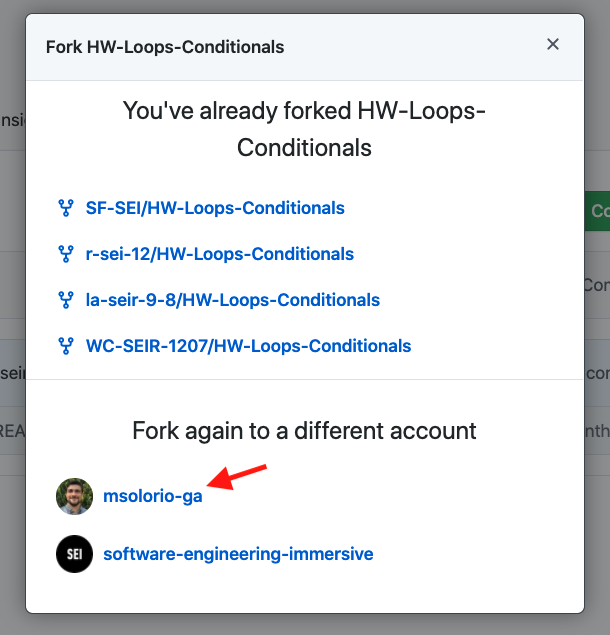

It will take a few seconds to copy the repository over from the classroom account to your own account.

---

We should now see the repository copied over. _Notice the top right corner indicates that you are now looking at the repository on your own account and not the class account._

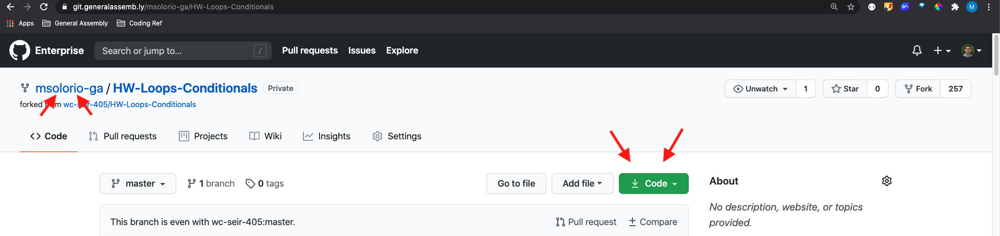

At this point we want to copy the repository from our account onto our own computers locally.

4. Click on the green button that says code. It should bring up a drop down with the Git URL for the repository on our own account. Click on the clipboard icon to copy the Git URL to your clipboard.

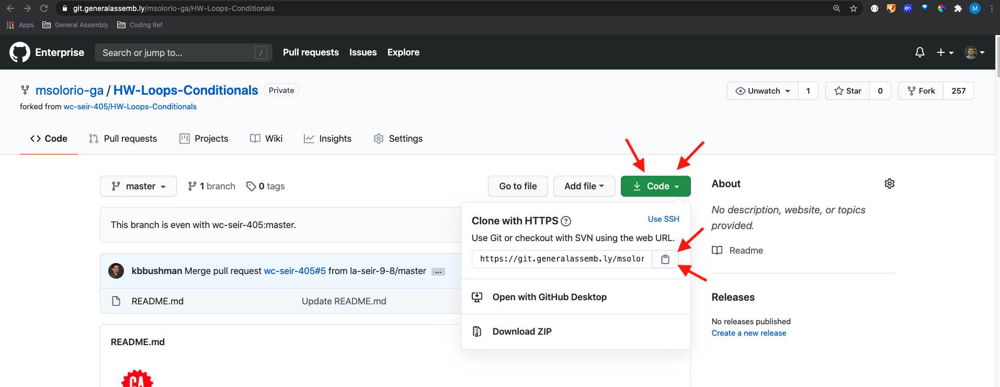

<br/>

---

5. On your local computer, create a directory (a.k.a. "folder") where you will store all of your classroom lessons and assignments. Within that folder, create additional folders where you will store your course work in an organized way. For example, your folder structure may look something like "general_assembly/unit_1/deliverables". How you organize your directories is up to you, but please make sure that however you name your directories, you do NOT have spaces in the name. For example, instead of naming a folder "unit 1", please name it "unit_1". 

6. Open your Terminal program and navigate to the directory where you will store your deliverables for Unit 1. Once you are in this directory, type `git clone` and then paste in the Git URL you copied from your clipboard.

The command will look something like this.
```bash
git clone https://git.generalassemb.ly/msolorio-ga/HW-Loops-Conditionals.git
```
Run that command and git will create a new directory with the name shown in the URL. In this case the directory will be called HW-Loops-Conditionals.

If everything went through successfully you should be able to see the new directory created by running the `ls` command.

<br/>

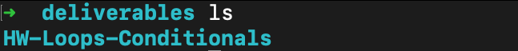

<br/>
By running `git clone <your-git-url>`, you've copied, or "cloned", the repository from your Github account to your own your own computer. This repository is what we call the "repo on your local machine". 

7. Use the `cd` command to step into your cloned repository.

8. Once inside the repository run `ls -la`.

You should see all of the files that exist in the repository. You will also notice there is a "hidden" directory (i.e. a folder name starting with a period) called `.git`. This indicates that this is infact a Git repository. Git has already been initialized and we do not need to run `git init`.

<br/>

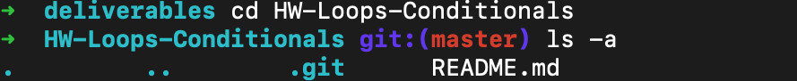

<br/>

---

<br/>

9. Running `git remote -v` will list out all of the remotes for the repository. It should display an origin remote that points to the Git URL you cloned from.

Later, when you are ready to push your work back to Github (the "repo in the cloud"), this is the origin remote you'll be pushing to.

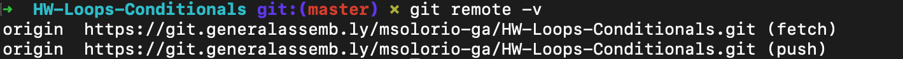

<br/>

From here, you are ready to start working on the assignment.

<br/>

---

<br/>

## Working on the Assignment

<br/>

1. Open the repository in your code editor.

2. Follow the instructions for the assignment, committing your work as needed.

<br/>

<details>
  <summary>A Reminder on Commands for Staging and Committing</summary>

  <br/>

  To see what the status of your changes are
  ```bash
  git status
  ```

  To move your changes to the staging area
  ```bash
  git add -A
  ```
  To commit your changes
  ```bash
  git commit -m 'write a message here that describes your changes'
  ```
</details>

<br/>

---

<br/>

## Submitting the Assignment

<br/>

Once you've completed your assignment and you are ready to submit it, double check that all of your work has been committed.

1. Run `git status`.

- If the output shows you files in red or green, add your changes to the staging area and/or commit your changes first. Then run `git status` to check if it went through.

- If the output of `git status` says "nothing to commit, working tree clean", all your work has been committed and you are ready to push your work to Github. 🙌

<br/>

---

<br/>

2. Run 

```bash
git push origin main
``` 

(If your local repo is set up with the default branch as "master" instead of "main", run `git push origin master` instead of `git push origin main`)

After a second or two you will see an output that looks like this.

<br/>

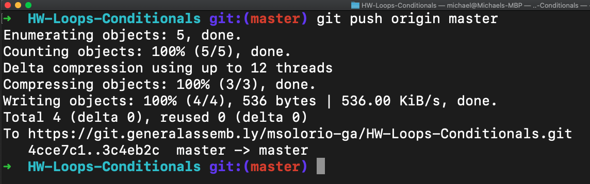

<br/>

3. You can now go back to the repository on your Github account. If you don't have it open any more you can click on your profile icon in the top right, and click on 'Your repositories' in the dropdown. From there you can find the repository for the assignment.

The page should indicate that this is the repository from your account.

<br/>

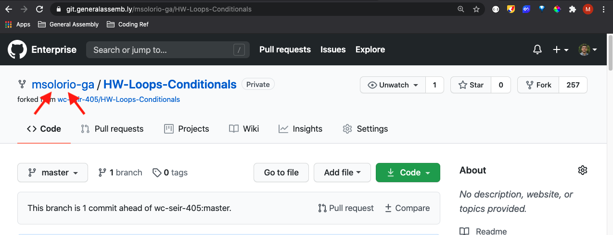

<br/>

---

<br/>

4. From this page, click on the "Pull requests" tab.

<br/>

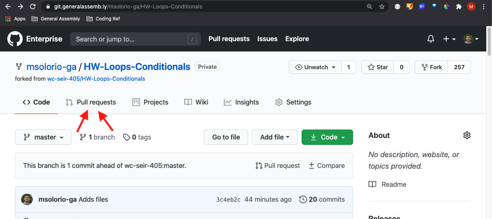

<br/>

---

<br/>

You will be taken to the "pull requests" page for the repo.

5. From here click on the green "New pull request" button.

<br/>


<br/>

---

<br/>

6. You'll be taken to another page to create your pull request. Here you will be able to confirm that you're making a pull request from the repository on _your account_ into the repository on the _class account_. It should look something like this.

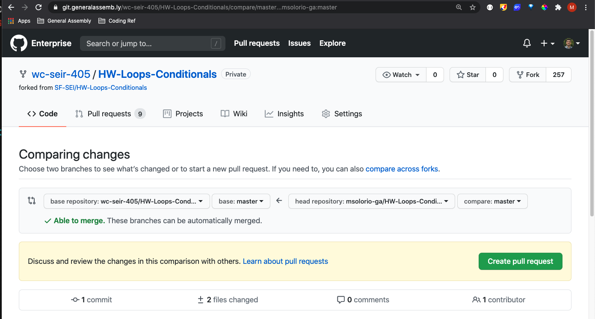

<br/>

---

<br/>

7. Once confirmed click the green "Create pull request" button.

From there it will take you to a page to add a title to your pull request. Type your name here and click "Create pull request" from this page.

<br/>

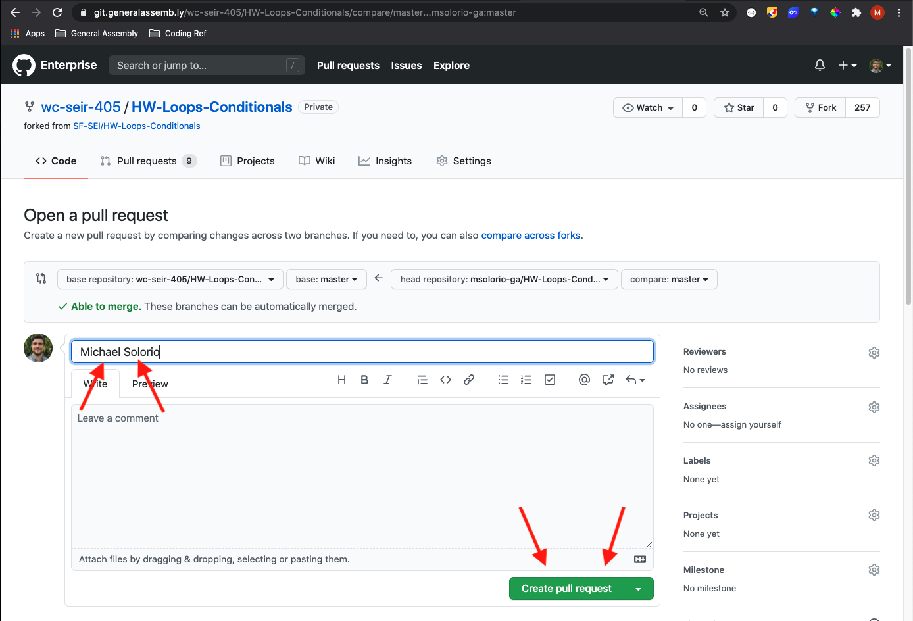

From there you are all set! You've just sumbitted the deliverable assignment.

You can double check that your pull request has been made by visiting the "Pull requests tab".

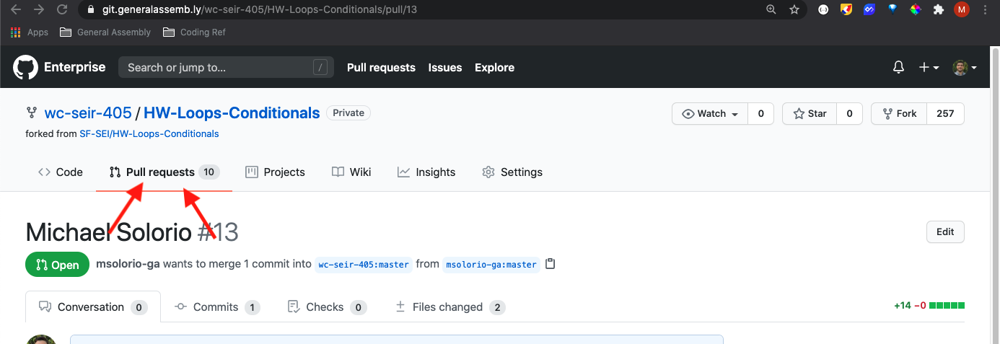

From there you should see your pull request on the list.
